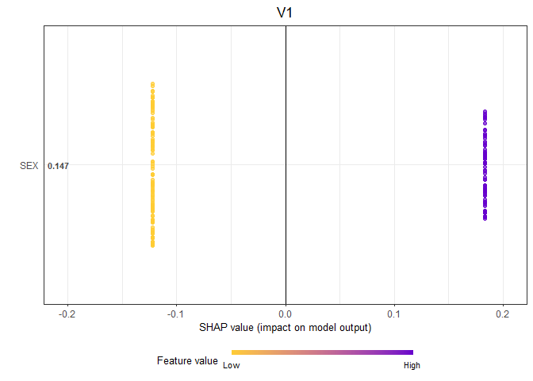
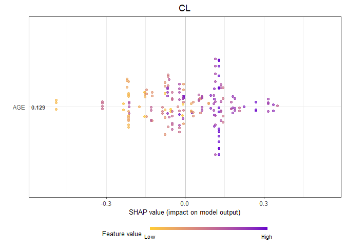

# mlcov

R package for selection of covariate effects using ML. Visit the [PAGE
Abstract](https://www.page-meeting.org/?abstract=10996) to learn more.

## Installation

``` r
if (!requireNamespace("remotes", quietly = TRUE)) {
  install.packages("remotes")
}

remotes::install_github("certara/mlcov")
```

# Usage

Import data file:

``` r
library(mlcov)

data_file <- system.file(package = "mlcov", "supplementary", "tab11")
data <- read.table(data_file, skip = 1, header = TRUE)
```

Perform covariate search:

``` r
result <- ml_cov_search(
  data = data,
  pop_param = c("V1","CL"),
  cov_continuous = c("AGE","WT","HT","BMI","ALB","CRT",
                    "FER","CHOL","WBC","LYPCT","RBC",
                    "HGB","HCT","PLT"),
  cov_factors = c("SEX","RACE","DIAB","ALQ","WACT","SMQ")
)
```

    ## Searching covariate effects on V1

    ## Searching covariate effects on CL

``` r
print(result)
```

    ## 
    ## Population Parameter:    V1 
    ## --------------------------
    ## Covariates Selected: SEX 
    ## 
    ## Population Parameter:    CL 
    ## --------------------------
    ## Covariates Selected: AGE, WT

Generate SHAP plots:

``` r
generate_shap_summary_plot(
  result,
  x_bound = NULL,
  dilute = FALSE,
  scientific = FALSE,
  my_format = NULL,
  title = NULL,
  title.position = 0.5,
  ylab = NULL,
  xlab = NULL
)
```

    ## $V1

<!-- -->

    ## 
    ## $CL

<!-- -->

Generate residual plots:

``` r
generate_residuals_plot(data = data, result, pop_param = 'CL')
```

    ## Testing pvalue significance for HT

    ## pvalues: 0.7,0.55,0.72,0.22,0.89,0.44,0.91,0.59,0.03,0.54

    ## FALSE

    ## Testing pvalue significance for BMI

    ## pvalues: 0.46,0.32,0.59,0.83,0.09,0.25,0.85,0.88,1,0.27

    ## FALSE

    ## Testing pvalue significance for ALB

    ## pvalues: 0.31,0.52,0.9,0.19,0.13,0.47,0.69,0.9,0.51,0.68

    ## FALSE

    ## Testing pvalue significance for CRT

    ## pvalues: 0.56,0.81,0.4,0.83,0.86,0.48,0.4,0.38,0.13,0.41

    ## FALSE

    ## Testing pvalue significance for FER

    ## pvalues: 0.97,0.42,0.06,0.38,0.38,0.33,0.86,0.65,0.58,0.92

    ## FALSE

    ## Testing pvalue significance for CHOL

    ## pvalues: 0.36,0.81,0.97,0.69,0.18,0.22,0.42,0.63,0.26,0.58

    ## FALSE

    ## Testing pvalue significance for WBC

    ## pvalues: 0.57,0.24,0.67,0.21,0.07,0.11,0.52,0.06,0.81,0.96

    ## FALSE

    ## Testing pvalue significance for LYPCT

    ## pvalues: 0.31,0.84,0.25,0.79,0.64,0.62,0.23,0.61,0.67,0.49

    ## FALSE

    ## Testing pvalue significance for RBC

    ## pvalues: 0.39,0.99,0.78,0.96,0.08,0.46,0.37,0.34,0.23,0.76

    ## FALSE

    ## Testing pvalue significance for HGB

    ## pvalues: 0.35,0.89,0.9,0.64,0.03,0.47,0.36,0.55,0.4,0.05

    ## FALSE

    ## Testing pvalue significance for HCT

    ## pvalues: 0.08,0.11,0.92,0.14,0.29,0.38,0.12,0.89,0.85,0.64

    ## FALSE

    ## Testing pvalue significance for PLT

    ## pvalues: 0.82,0.68,0.67,0.53,0.9,0.69,0.31,0.7,0.54,0.91

    ## FALSE

    ## Testing pvalue significance for SEX

    ## pvalues: 0.95,0.82,0.89,0.96,0.89,0.75,0.03,0.99,0.21,0.67

    ## FALSE

    ## Testing pvalue significance for RACE

    ## pvalues: 0.31,0.34,0.07,0.58,0.15,0.09,0.86,0.17,0.91,0.6

    ## FALSE

    ## Testing pvalue significance for DIAB

    ## pvalues: 0.25,0.73,0.59,0.23,0.98,0.21,0.28,0.66,0.24,0.07

    ## FALSE

    ## Testing pvalue significance for ALQ

    ## pvalues: 0.74,0.78,0.38,0.27,0.21,0.31,0.93,0.81,0.29,0.86

    ## FALSE

    ## Testing pvalue significance for WACT

    ## pvalues: 0.81,0.83,0.36,0.55,0.56,0.84,0.56,0.83,0.66,0.91

    ## FALSE

    ## Testing pvalue significance for SMQ

    ## pvalues: 0.86,0.21,0.71,0.3,0.6,1,0.48,0.81,0.35,0.77

    ## FALSE

    ## No residuals plots with a significant p-value for CL

    ## NULL

``` r
generate_residuals_plot(data = data, result, pop_param = 'V1')
```

    ## Testing pvalue significance for AGE

    ## pvalues: 0.33,0.37,0.39,0.93,0.82,0.66,0.74,0.54,0.82,0.38

    ## FALSE

    ## Testing pvalue significance for WT

    ## pvalues: 0.02,0.54,0.33,0.01,0,0.08,0,0.02,0.14,0.12

    ## FALSE

    ## Testing pvalue significance for HT

    ## pvalues: 0.54,0.08,0.91,0.29,0.23,0.11,0.36,0.44,0.85,0.24

    ## FALSE

    ## Testing pvalue significance for BMI

    ## pvalues: 0.12,0.38,0.01,0.25,0.15,0.26,0.52,0,0.05,0.2

    ## FALSE

    ## Testing pvalue significance for ALB

    ## pvalues: 0.13,0.74,0.6,0.18,0.18,0.39,0.8,0.75,0.58,0.19

    ## FALSE

    ## Testing pvalue significance for CRT

    ## pvalues: 0.01,0.24,0.44,0.62,0.83,0.76,0.84,0.12,0.92,0.45

    ## FALSE

    ## Testing pvalue significance for FER

    ## pvalues: 0.24,0.07,0.85,0.93,0.15,0.8,0.5,0.5,0.03,0.63

    ## FALSE

    ## Testing pvalue significance for CHOL

    ## pvalues: 0.47,0.74,0.76,0.97,0.44,0.27,0.37,0.41,0.11,0.04

    ## FALSE

    ## Testing pvalue significance for WBC

    ## pvalues: 0.13,0.16,0.25,0.36,0.88,0.93,0.77,0.64,0.39,0.59

    ## FALSE

    ## Testing pvalue significance for LYPCT

    ## pvalues: 0.26,0.34,0.74,0.44,0.58,0.51,0.63,0.56,0.7,0.93

    ## FALSE

    ## Testing pvalue significance for RBC

    ## pvalues: 0.61,0.2,0.65,0.24,0.42,0.34,0.48,0.01,0.06,0.95

    ## FALSE

    ## Testing pvalue significance for HGB

    ## pvalues: 0.78,0.93,0.17,0.23,0.58,0.95,0.19,0.34,0.86,0.33

    ## FALSE

    ## Testing pvalue significance for HCT

    ## pvalues: 0.22,0.35,0.73,0.73,0.33,0.78,0.53,0.77,0.86,0.8

    ## FALSE

    ## Testing pvalue significance for PLT

    ## pvalues: 0.28,0.67,0.85,0.17,0.78,0.96,0.96,0.58,0.72,0.15

    ## FALSE

    ## Testing pvalue significance for RACE

    ## pvalues: 0.22,0.2,0.21,0.75,0.81,0.63,0.71,0.29,0.26,0.59

    ## FALSE

    ## Testing pvalue significance for DIAB

    ## pvalues: 0.85,0.83,0.54,0.13,0.35,0.27,0.13,0.21,0.25,0.91

    ## FALSE

    ## Testing pvalue significance for ALQ

    ## pvalues: 0.21,0.14,0.7,0.53,0.4,0.18,0.38,0.75,0.94,0.38

    ## FALSE

    ## Testing pvalue significance for WACT

    ## pvalues: 0.61,0.37,0.66,0.45,0.22,0.18,0.18,0.06,0.07,0.78

    ## FALSE

    ## Testing pvalue significance for SMQ

    ## pvalues: 0.64,0.16,0.26,0.88,0.77,0.25,0.68,0.35,0.07,0.66

    ## FALSE

    ## No residuals plots with a significant p-value for V1

    ## NULL
