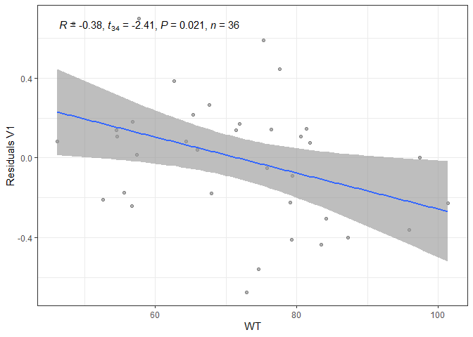

# mlcov

R package for selection of covariate effects using ML.

The methodology implemented in the `mlcov` R package consists of 4 key
steps:

1.) The dataset, comprised of empirical Bayesian estimates of individual
parameters (EBEs) and covariate sets, is randomly split into five folds
(step 1, data splitting).

2.) The covariate selection (step 2) is performed by applying the Lasso
algorithm to reduce irrelevant or redundant covariates due to
correlation followed by the Boruta algorithm to iteratively identify
relevant covariates based on their importance scores.

3.) A voting mechanism (step 3) across folds determines the final
selected covariates based on their robustness. Note that these first
three steps are implemented by a simple call to the function
`ml_cov_search`.

4.) Finally, residual plots (step 4) are employed to evaluate the
covariate-parameter relationships.Following the covariate selection
using the proposed ML method, an XGboost model is trained on the
selected covariates and the remaining trends between residuals
(difference between the actual target values and the model’s predicted
values) and unselected covariates are examined. The primary goal is to
ensure that the ML method did not overlook any significant trends or
relationships that could be captured by additional covariates. This step
is implemented in a separate function `generate_residual_plots`.

Visit the [PAGE Abstract](https://www.page-meeting.org/?abstract=10996)
to learn more.

## Installation

``` r
if (!requireNamespace("remotes", quietly = TRUE)) {
  install.packages("remotes")
}

remotes::install_github("certara/mlcov")
```

# Usage

Import data file:

``` r
library(mlcov)

data_file <- system.file(package = "mlcov", "supplementary", "tab33")
data <- read.table(data_file, skip = 1, header = TRUE)
```

Perform covariate search:

``` r
result <- ml_cov_search(
  data = data,
  pop_param = c("V1","CL"),
  cov_continuous = c("AGE","WT","HT","BMI","ALB","CRT",
                    "FER","CHOL","WBC","LYPCT","RBC",
                    "HGB","HCT","PLT"),
  cov_factors = c("SEX","RACE","DIAB","ALQ","WACT","SMQ")
)
```

    ## Searching covariate effects on V1

    ## Searching covariate effects on CL

``` r
print(result)
```

    ## 
    ## Population Parameter:    V1 
    ## --------------------------
    ## Covariates Selected: SEX 
    ## 
    ## Population Parameter:    CL 
    ## --------------------------
    ## Covariates Selected: AGE

Generate SHAP plots:

``` r
generate_shap_summary_plot(
  result,
  x_bound = NULL,
  dilute = FALSE,
  scientific = FALSE,
  my_format = NULL,
  title = NULL,
  title.position = 0.5,
  ylab = NULL,
  xlab = NULL
)
```

    ## $V1

<!-- -->

    ## 
    ## $CL

<!-- -->

Generate residual plots:

``` r
generate_residuals_plot(data = data, result, pop_param = 'CL')
```

    ## Testing pvalue significance for WT

    ## Testing pvalue significance for HT

    ## Testing pvalue significance for BMI

    ## Testing pvalue significance for ALB

    ## Testing pvalue significance for CRT

    ## Testing pvalue significance for FER

    ## Testing pvalue significance for CHOL

    ## Testing pvalue significance for WBC

    ## Testing pvalue significance for LYPCT

    ## Testing pvalue significance for RBC

    ## Testing pvalue significance for HGB

    ## Testing pvalue significance for HCT

    ## Testing pvalue significance for PLT

    ## Testing pvalue significance for SEX

    ## Testing pvalue significance for RACE

    ## Testing pvalue significance for DIAB

    ## Testing pvalue significance for ALQ

    ## Testing pvalue significance for WACT

    ## Testing pvalue significance for SMQ

    ## No residuals plots with a significant p-value for CL

    ## NULL

``` r
generate_residuals_plot(data = data, result, pop_param = 'V1')
```

    ## Testing pvalue significance for AGE

    ## Testing pvalue significance for WT

    ## Testing pvalue significance for HT

    ## Testing pvalue significance for BMI

    ## Testing pvalue significance for ALB

    ## Testing pvalue significance for CRT

    ## Testing pvalue significance for FER

    ## Testing pvalue significance for CHOL

    ## Testing pvalue significance for WBC

    ## Testing pvalue significance for LYPCT

    ## Testing pvalue significance for RBC

    ## Testing pvalue significance for HGB

    ## Testing pvalue significance for HCT

    ## Testing pvalue significance for PLT

    ## Testing pvalue significance for RACE

    ## Testing pvalue significance for DIAB

    ## Testing pvalue significance for ALQ

    ## Testing pvalue significance for WACT

    ## Testing pvalue significance for SMQ

    ## $WT

    ## `geom_smooth()` using formula = 'y ~ x'

<!-- -->
