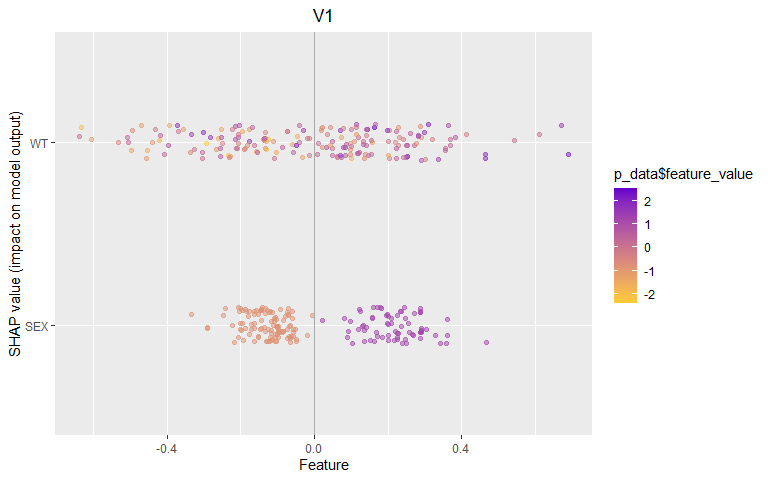
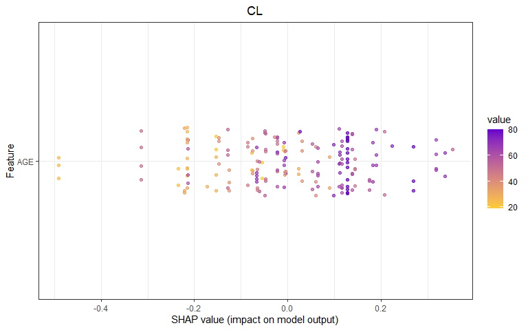

# mlcov

R package for selection of covariate effects using machine learning.

The workflow in `mlcov` has four steps:

1.  **Data splitting.** The data set of empirical Bayes estimates (EBEs)
    and covariates is randomly split into `n_folds` folds (default 5).

2.  **Covariate selection.** Optional Lasso pre-screening reduces
    correlated or redundant covariates. Boruta then confirms relevant
    covariates using a tree-based learner: LightGBM (default), random
    forest, XGBoost, or CatBoost.

3.  **Voting.** Covariates confirmed in at least `vote_threshold` folds
    (default 2) are retained. Steps 1–3 are a single call to
    `ml_cov_search()`.

4.  **Diagnostics (optional).** `generate_shap_summary_plot()` explains
    the selected set with XGBoost SHAP values.
    `generate_residuals_plot()` checks unselected covariates for
    leftover residual trends.

The recommended default matches the v2 evaluation study: Lasso with
`lambda.min` plus Boruta-LightGBM. Random forest remains available but
had high Type I error in that study and is not the recommended default.

A worked argument reference, manuscript-faithful settings, and
diagnostic examples are in the vignette
`vignette("mlcov-updated-usage", package = "mlcov")`.

Visit the [PAGE 2024
abstract](https://www.page-meeting.org/?abstract=10996) for the original
package description.

## Installation

``` r
if (!requireNamespace("remotes", quietly = TRUE)) {
  install.packages("remotes")
}

remotes::install_github("certara/mlcov")
```

CatBoost is optional and is not on CRAN. Install it only if you set
`boruta_algorithm = "catboost"`; see the [CatBoost R installation
notes](https://catboost.ai/en/docs/installation/r-installation).

# Usage

Import data file:

``` r
library(mlcov)

data_file <- system.file(package = "mlcov", "supplementary", "tab33")
data <- read.table(data_file, skip = 1, header = TRUE)
```

Perform covariate search (LightGBM + Lasso `lambda.min` by default):

``` r
result <- ml_cov_search(
  data = data,
  pop_param = c("V1", "CL"),
  cov_continuous = c("AGE", "WT", "HT", "BMI", "ALB", "CRT",
                    "FER", "CHOL", "WBC", "LYPCT", "RBC",
                    "HGB", "HCT", "PLT"),
  cov_factors = c("SEX", "RACE", "DIAB", "ALQ", "WACT", "SMQ")
)
print(result)
```

    ## mlcov covariate search
    ##   Algorithm:        lightgbm
    ##   Lasso:            yes (lambda.min)
    ##   Folds / vote:     5 / 2
    ##   log_ebes:         TRUE
    ##   Boruta p-value:   0.01
    ##   Boruta maxRuns:   200
    ## 
    ## Population Parameter:    V1
    ## --------------------------
    ## Covariates Selected: SEX, WT
    ## 
    ## Population Parameter:    CL
    ## --------------------------
    ## Covariates Selected: AGE

0.0.2-compatible search (XGBoost + Lasso `lambda.1se`), shown for the
previous defaults. Not evaluated here so the README knit runs a single
search:

``` r
result_xgb <- ml_cov_search(
  data = data,
  pop_param = c("V1", "CL"),
  cov_continuous = c("AGE", "WT", "HT", "BMI", "ALB", "CRT",
                    "FER", "CHOL", "WBC", "LYPCT", "RBC",
                    "HGB", "HCT", "PLT"),
  cov_factors = c("SEX", "RACE", "DIAB", "ALQ", "WACT", "SMQ"),
  boruta_algorithm = "xgboost",
  use_lasso = TRUE,
  lambda_lasso = "lambda.1se"
)
```

Generate SHAP plots:

``` r
shap_plots <- generate_shap_summary_plot(
  result,
  data,
  title.position = 0.5
)
invisible(lapply(shap_plots, print))
```

<!-- --><!-- -->

Generate residual plots:

``` r
cl_resid <- generate_residuals_plot(data = data, result, pop_param = "CL")
if (is.null(cl_resid)) {
  cat("No significant residual trends for CL.\n")
} else {
  invisible(lapply(cl_resid, print))
}
```

    ## No significant residual trends for CL.

``` r
v1_resid <- generate_residuals_plot(data = data, result, pop_param = "V1")
if (is.null(v1_resid)) {
  cat("No significant residual trends for V1.\n")
} else {
  invisible(lapply(v1_resid, print))
}
```

    ## No significant residual trends for V1.
